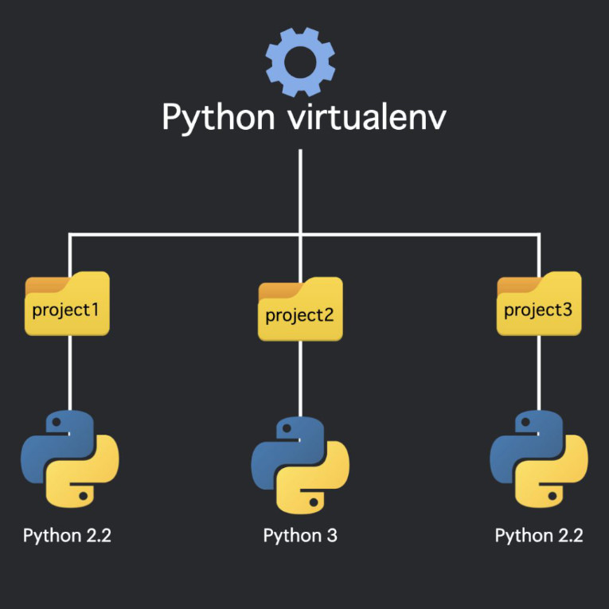

# Ambiente Virtual Python (venv)

## Sumário
- [O que é uma venv?](#-o-que-é-uma-venv)
- [Criando um ambiente virtual](#-criando-um-ambiente-virtual)
- [Ativar um ambiente virtual](#-ativar-um-ambiente-virtual)
- [Instalando pacotes](#-instalando-pacotes)
- [Usando pacotes](#-usando-pacotes)
- [Desativar um ambiente virtual](#-desativar-um-ambiente-virtual)
- [Deletar um ambiente virtual](#-deletar-um-ambiente-virtual)

## ❓ O que é uma venv?
Um ambiente isolado no computador para executar projetos Python.

Permite gerenciar depêndencias específicas de projetos.

Não intefere em outros projetos ou na instalação original do Python.

Imagine o ambiente virtual como um container separado para cada projeto Python. Um container:

- que contém o próprio interpretador Python.
- que contém o próprio conjunto de pacotes instalados.
- é isolado de outros ambientes virtuais.
- pode ter diferentes versões de um mesmo pacote.

Usar ambientes virtuais é importante porque:

- previne conflito de versões entre pacotes de diferentes projetos.
- Torna projetos mais portáveis e reproduziveis.
- Mantém sua instalação do Python, no sistema, limpa.
- Permite teste com diferentes versões do Python.

### Imagem ilustrativa:


## 📁 Criando um ambiente virtual

Python tem o módulo embutido venv para criar ambientes virtuais.

Para criar um ambiente virtual:

- Abra o prompt de comando.

- Navegue até a pasta onde você quer criar seu projeto.

- Escreva o comando:

Rode este comando para criar um ambiente virtual chamado *myfirstproject*.

Windows:
```shell
C:\Users\Your_Name> python -m venv myfirstproject 
```

masOS/Linux:
```bash
$ python -m venv myfirstproject 
```

Esse comando irá definir um ambiente virtual.

Cria um diretório chamado "myfirstproject" com sub-pastas e arquivos, como:

Os estrutura de arquivo/diretório se parecerá com essa:
```
myfirstproject
  Include
  Lib
  Scripts
  .gitignore
  pyvenv.cfg 
```

## ✅ Ativar um ambiente virtual

Para usar o ambiente virtual, você tem que ativá-lo com esse comando:

Ativar o ambiente virtual:

Windows:
```shell
C:\Users\Your_Name> myfirstproject\Scripts\activate 
```

masOS/Linux:
```bash
$ source myfirstproject/bin/activate 
```

Após a ativação, seu prompt irá mudar.

Mostra que agora você está trabalhando no ambiente ativado.

A linha de comando se parecerá com essa quando o ambiente virtual é ativado:

Windows:
```shell
(myfirstproject) C:\Users\Your_Name> 
```

macOS/Linux:
```bash
(myfirstproject) ... $ 
```

## 📦 Instalando pacotes
Uma vez que seu ambiente virtual é ativado, você pode instalar pacotes nele, usando pip.

Nós instalaremos um pacote chamado 'cowsay':

Instale 'cowsay' no ambiente virtual:

Windows:
```shell
(myfirstproject) C:\Users\Your_Name> pip install cowsay 
```

macOS/Linux:
```shell
(myfirstproject) ... $ pip install cowsay 
```

'Cowsay' é instalado somente no ambiente virtual:

```bash
Collecting cowsay
  Downloading cowsay-6.1-py3-none-any.whl.metadata (5.6 kB)
Downloading cowsay-6.1-py3-none-any.whl (25 kB)
Installing collected packages: cowsay
Successfully installed cowsay-6.1

[notice] A new release of pip is available: 25.0.1 -> 25.1.1
[notice] To update, run: python.exe -m pip install --upgrade pip
```

## 📥 Usando pacotes
Agora que o módulo 'cowsay' está instalado no seu ambiente virtual, vamos usá-lo para exibir uma vaca falante.

Crie um arquivo chamado **test.py** no seu computador.

Você pode colocá-lo onde quer que você queria.

Mas eu colocarei no mesmo local que o diretório **myfirstproject**, - não dentro da pasta, mas no mesmo local.

Abra o arquivo e insira essas três linhas nele:

Insira duas linhas em **test.py**:

```python
# test.py
import cowsay

cowsay.cow("Good Mooooorning!")
```

Então, tente executar o arquivo enquanto você está no ambiente virtual:

Execute **test.py** no ambiente virtual:

Windows:
```shell
(myfirstproject) C:\Users\Your_Name> python test.py 
```

macOS/Linux:
```bash
(myfirstproject) ... $ python test.py 
```

Como um resultado uma vaca irá aprecer no seu terminal:

O propósito do módulo 'cowsay' é desenhar uma vaca que diz qualquer que seja a entrada que você dê a ela:

```bash
  _________________
| Good Mooooorning! |
  =================
                 \
                  \
                    ^__^
                    (oo)\_______
                    (__)\       )\/\
                        ||----w |
                        ||     ||

```

## 🛑 Desativar um ambiente virtual

Para desativar o ambiente virtual use esse comando:

Desativar o ambiente virtual:

Windows:
```shell
(myfirstproject) C:\Users\Your_Name> deactivate 
```

macOS/Linux:
```bash
(myfirstproject) ... $ deactivate 
```

Como um resultado, você está agora de volta na interface de linha de comando normal.

Windows:
```shell
C:\Users\Your_Name> 
```

masOS/Linux:
```bash
$ 
```

Se você tentar executar o arquivo **test.py** fora do ambiente virtual, você irá obter um erro porque 'cowsay' está faltando.

Ela foi instalada apenas no ambiente virtual:

Execute **test.py** fora do ambiente virtual:

Windows:
```shell
C:\Users\Your_Name> python test.py 
```

masOS/Linux:
```bash
$ python test.py 
```

Erro porque 'cowsay' está faltando:

```bash
Traceback (most recent call last):
  File "C:\Users\Your Name\test.py", line 1, in <module>
    import cowsay
ModuleNotFoundError: No module named 'cowsay'
```

**Note**: O ambiente virtual **myfirstproject** ainda existe, ele só não está ativado. Se você ativar o ambiente virtual novamente, você pode executar o arquivo **test.py**, e o diagrama será exibido.

## ❎ Deletar um ambiente virtual

Outra coisa boa sobre trabalhar com um ambiente virtual é que quando você, por alguma razão quer deletá-lo, não há outros projetos que dependam dele, e somente os módulos e arquivos no ambiente virtual especificado são deletados.

Para deletar um ambiente virtual, você pode simplesmente deletar o diretório dele com todo o conteúdo dele. Seja diretamente no sistema de arquivos, ou use a interface de linha de comando como esse:

Delete **myfirstproject** pela interface de linha de comando:

Windows:
```shell
C:\Users\Your_Name> rmdir /s /q myfirstproject 
```

masOS/Linux:
```bash
$ rm -rf myfirstproject 
```

---
## Referências
[w3schools - python virtualenv](https://www.w3schools.com/python/python_virtualenv.asp)